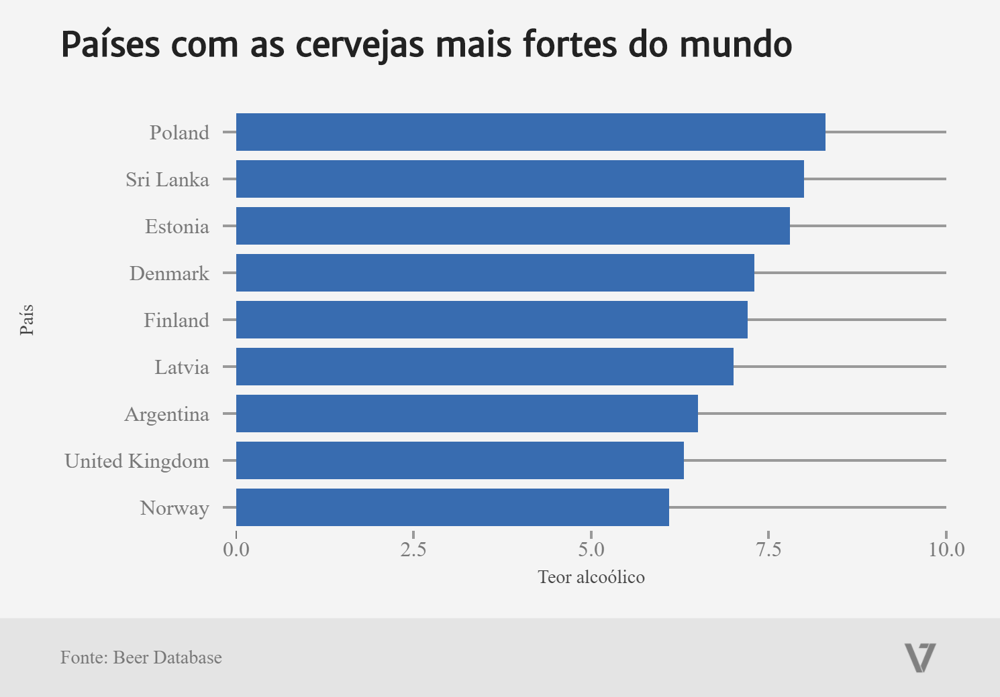

# Os países com as cervejas mais fortes de mundo

Polônia lidera o ranking de países com cervejas de maior teor alcoólico médio.

  

### [Fonte original](https://github.com/brewdega/open-beer-database-dumps)
